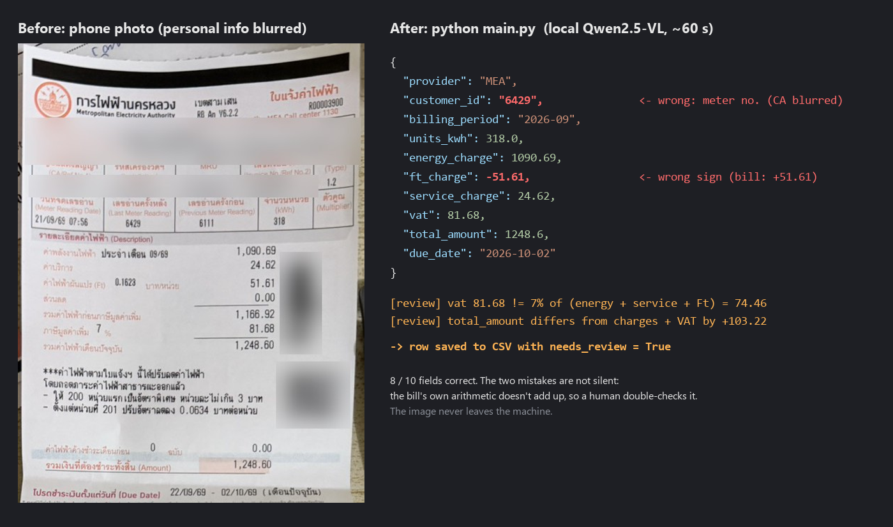

# Thai Electricity Bill OCR (Local / On-Premise)

Turn a photo of a Thai electricity bill (ใบแจ้งค่าไฟฟ้า, MEA / PEA) into clean,
structured data — **running entirely on your own machine**. No cloud, no third-party
API. Powered by a local vision LLM (Qwen2.5-VL in LM Studio).



*A real run on my own bill (personal info blurred; input: `docs/demo-bill-blurred.jpg`).*

## Problem

Small shops, freelancers and back-office staff still key bills into spreadsheets by
hand — slow (~2 min per bill) and error-prone. Electricity bills also contain the
customer's ID and address, so sending them to a cloud OCR service is a privacy risk
many businesses won't accept.

## Solution

```
Bill photo  ->  Qwen2.5-VL (local)  ->  structured JSON  ->  CSV / Google Sheet
```

Everything runs on-premise. The image never leaves the machine.

## Why local LLM

- **Privacy** — financial + personal data stays in-house.
- **No per-call cost** — no cloud OCR fees.
- **Works offline** — deployable inside a company network with no internet.

## Stack

- **Python 3.10+**
- **LM Studio** serving `qwen/qwen2.5-vl-7b` (vision model, local) through its
  OpenAI-compatible API — so it also works with Ollama / vLLM / llama.cpp
- **Pydantic** for a strict output schema + validation
- CSV export built in; Google Sheet export as a stretch goal

## How it works

1. `src/schema.py` defines the exact fields to extract (Pydantic model) and
   normalizes Thai dates (month names, พ.ศ. years) to ISO format in plain Python.
2. `src/extract.py` sends the image + a prompt to Qwen2.5-VL and forces the output
   to match the schema (structured output).
3. `src/validate.py` checks the bill's own arithmetic (energy + service + Ft, 7% VAT,
   total). A small model sometimes invents numbers or reads the wrong part of the
   paper, so rows that don't add up are marked `needs_review` instead of trusted.
4. `src/export.py` appends the validated record to a CSV (and, later, a Google Sheet).
5. `main.py` ties it together as a small CLI.
6. `evaluate.py` scores the extraction against hand-checked labels
   (`samples/labels.json`, see `labels.example.json`) — per field, per bill, and
   how many bad bills the review flag catches.

## Setup

1. Install [LM Studio](https://lmstudio.ai), download **Qwen2.5-VL-7B**
   (`qwen/qwen2.5-vl-7b`), load it, and start the local server (Developer tab,
   default `http://localhost:1234`).
2. Python deps:

   ```powershell
   python -m venv .venv
   .venv\Scripts\activate          # macOS/Linux: source .venv/bin/activate
   pip install -r requirements.txt
   ```

3. Run on one or more bill photos:

   ```powershell
   python main.py samples/bill1.jpg
   python main.py samples/bill1.jpg samples/bill2.jpg --csv output/bills.csv
   ```

   PowerShell doesn't expand `samples/*.jpg`; pass files explicitly, or use
   `python main.py (Get-ChildItem samples/*.jpg).FullName`.

To use a different local server or model, set `LLM_BASE_URL` / `LLM_MODEL`
(see `.env.example`).

## Taking the photo

Photograph **only the bill part** (ใบแจ้งค่าไฟฟ้า, from the logo down to the
Due Date line), flat and in focus. MEA bills often have *last month's receipt*
printed on the same paper below the bill, with different numbers — when it is in
the frame, the model tends to read those instead.

## Results

Measured with `python evaluate.py` on 4 real MEA bills (1 scan, 1 older photo,
2 phone photos), Qwen2.5-VL-7B in LM Studio, CPU only (Intel iGPU, 32 GB RAM).
This is an honest baseline, not a final score.

| Field | Correct |
|---|---|
| provider | 4/4 |
| customer_id, units_kwh, due_date | 3/4 |
| energy_charge, ft_charge, service_charge, vat, total_amount | 2/4 |
| billing_period | 1/4 |
| **Overall** | **24/40 fields (60%)** |

- Time per bill: **~40–60 s** on CPU (vs ~2 min by hand).
- Prompt iteration example: `units_kwh` came back null on 3 of 4 bills. Describing
  the meter row column by column (and that units = last − previous reading) took it
  from 1/4 to 3/4 and the overall score from 50% to 60%.
- The scanned bill: 9/10. Phone photos with last month's receipt in frame: 3/10 and
  5/10; cropped to just the bill (as in the demo above): 8/10.
- **The `needs_review` check flagged every bill whose amounts were wrong**, with no
  false alarm on a correct bill — wrong numbers don't silently reach the CSV.

What didn't help (tried and measured): asking the model to locate the bill section
for auto-cropping (boxes were unreliable), cropping to the paper edges (same 50%),
and Gemma 4 E4B (same 50%, ~10 min per bill on CPU).

Next: test newer vision models of similar size with `evaluate.py`, and add more
bills — especially PEA.

## Roadmap

- [x] Layer 1 — image → validated JSON (core) — works; accuracy on phone photos is
      the open problem (see Results)
- [ ] Layer 2 — auto-append to Google Sheet (`gspread`)
- [ ] Layer 3 — monthly summary per customer
- [ ] Simple web UI (upload photo in browser)

## Notes

This is a proof-of-concept portfolio project. Bill images in `samples/` are my own.
